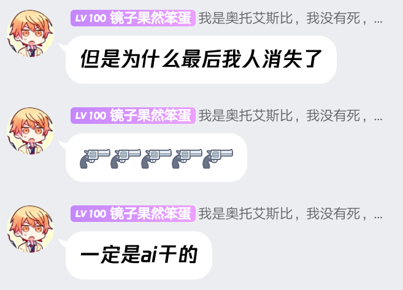

# 镜子大冒险
镜子在火星上生活的时间长，虽然在外星的科技中，他们的飞船已经是很先进的科技，但是在地球的文明程度中，还远远无法达到，他们的飞船在地球已经算是最先进的了。
北鸡是一个聪明的人，他知道如何使用自己的智慧去获取利益，他知道自己现在最应该做的事情就是将火星上的资源统统搬运到自己的飞船上，并且建立起一座属于自己的城市。
北鸡的具标很明确，那就是将火星的资源统统搬到自己的飞船上，并且在地球上建立一座属于自己的城市，这一切都是北鸡的计划。
但是，当北鸡将火星上的资源搬空之后，火星上的人却没有什么行动，反而是北鸡在火星上找了一个合适的地方建立了一座城市，而且还是一座非常豪华的城市。
北鸡将火星上的所有资源都搬光了之后，北鸡就在火星上建立了自己的王国。
北鸡的王国叫“南宫王国”，他的王国里面有大量的资源和矿产，这些都可以提供给他的手下使用。而且王国内还有很多优秀的人员和资源，这一切北鸡都不放在眼里，他现在已经开始着手对其他的国家开战了。
这一次，北鸡将对其他国家发动战争，他要将火星上剩余的资源全部拿到自己的手上，而且他也要对整个火星进行一番大清洗，将火星上所有的资源和矿产统统都拿过来，这样他的实力将会变得更加强悍。
但是就在这一次，他却遭遇到了前所未有的危机。因为，他们刚刚攻打完了一个小国家，这个小国家里面的人员非常顽固，不肯将自己的资源交出来，甚至还反抗起来。他们的军队将那个小国家包围了起来。
而那个小国家的领袖竟然派出自己手下的将军，带领着一支百万人规模的队伍与他们决斗，双方一直僵持在原地，谁也没有退缩。
最终，那个小国家的将军被杀死了，但是他的尸体却被留下了，因为他的尸体可以制作成为傀儡，而北鸡的将军的尸体也同样可以制作成为傀儡。。
北鸡的将军死了之后，就将所有的尸体统统扔向那个小国家，这一次，北鸡的将军是抱着必胜的信念来战斗的，他的身体被投掷之后就变成了无数的碎片，而这些碎片被投射到那些傀儡的身上，这些傀儡就会发动自己的攻击。
北鸡的那些军队根本抵挡不住这些傀儡的攻击，他们最终的结局就是全军覆没，一个都不剩。
当然，这些都只是北鸡在攻占那个小国家之后发生的事情，此刻的翼风依旧还在地球上，他还处在梦乡之中，根本不知道自己在地球上发生的一切。而就在翼风沉浸在梦乡之中的时候，突然，一阵急促的铃声从他的口袋里传来，翼风一下子惊醒了。这一次翼风被电话铃声吵醒，不过他依旧睡意朦胧，不知道到底发生了什么事情。
翼风伸出双臂，将床头柜上的电话抓到自己的手里，看也没看一下来电显示，便接通了。
翼风的语气中充满了困倦，但他仍然还是强忍着睡意接通电话。
“"喂?“翼风懒洋洋的说道。
这个时候，翼风的脑海中突然出现了一个女性的声音。
“你好，请问你是翼风吗?“这个女人的声音听上去
很熟悉，但是翼风的思维却陷入了停顿。
“我是翼风，请问你是谁?“翼风揉了揉自己的眼睛，疑惑的问道。
“呵呵。我是谁不重要，重要的是我知道你现在在哪里，请你现在立即到地铁站，我会在那里等你。“这个女人笑着说道。
翼风的心中不断的回响这这句话：我现在在哪儿，我怎么会在地铁站呢?难道我真的穿越到了地铁站?可是我明明记得昨天我还在火星啊!
翼风的脑海中不由得冒出一连串的问号，但是这些问号都没办法回答，所以他只能够挂掉电话，然后赶紧跑下了床，向地铁站走去。
翼风刚刚跑下楼梯，就听见楼下一阵喧闹，好像是有人在吵架。翼风走出房间，向楼下看去，发现一群人聚集在一起正在吵架，而且还有人不断的向那些人扔东西，那些人则在不断的躲闪着。
“你tmd给老子站住，老子今天要教训教训你们，让你们知道我的厉害!”一个男人怒骂道。
翼风看着这一幕，感觉非常的奇怪，他看到有一群人在楼梯旁边围观着，但是这群人的脸上都露出一副畏惧的表情，好像看到什么很可怕的东西似的。而在人群中的一群男男女女都在不断的后退。
看到这种情况，翼风的心里面非常的奇怪，他快速的向楼梯那边走了过去，当走近之后，翼风终于知道为什么那些男男女女都在后退了，他们看到了楼梯上站着一个男子，这个男子身材非常高，足足比一般人高出了两倍多，他一个人静静的站在那里，他就如同一尊雕塑一样，给人一股非常恐怖的压迫感。
翼风慢慢的走向了人群中，走到这些人的前面。翼风看了一眼人群中的那些人。
**power by 彩云小梦**
**精彩评论**
