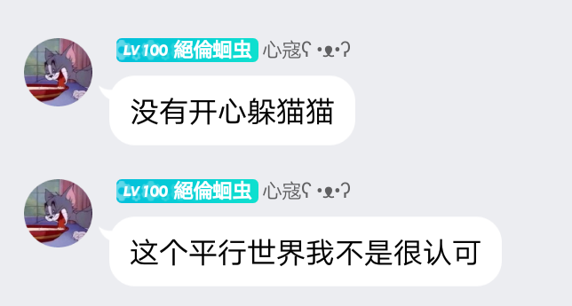

# 第二章 熊头镇奇遇
“呼哧，呼味~”
“这里真的是太美丽了!“奶哥看着周围的环境开口说道。
"嗯!确实很美丽!“鱼叔开口说道。
“好了，我们先去买点东西吃吧，肚子好饿啊!“奶哥开口说道。
听到奶哥的话，鱼叔开口说道：好的!我们这就
去!"
说完，鱼叔便带领着奶哥等人朝着不远处的小卖部走了过去。
“老板，给我来五份烤肉串，五瓶啤酒!“奶哥开口叫道。
闻言，老板开口说道：“好嘞，马上给你送过来!”
"奶哥，你要喝红酒吗?“鱼叔开口问道。
奶哥摇了摇头说道：“不用了，我喜欢吃烤肉串，喝啤酒就行了!”
“好嘞!”
"奶哥，你想吃什么?我去给你弄!”“我什么都可以!”
很快，烤肉串就被鱼叔端了过来，鱼叔和奶哥两个人开始吃起来。
看着两人吃得津津有味，翼风三个人的脸上都流露出了灿烂的笑容。
就在这个时候，翼风的手机铃声忽然响了起来，拿出手机一看，是一个陌生号码打过来的。
接通电话以后，翼风便开口说道：“喂，您好!”
“您好，翼风先生，我是城南北巷的小白，现在方便见个面吗?”
“嗯?”
听到小白的话，翼风愣了一下，随后开口说道：“小白，你找我有什么事吗?我现在正在忙着，可能没空去见你，你找别人聊天吧!”
“没关系，我可以在那边等你!”"呃.....好吧!”
“那么，祝你今天玩的愉快!"
“嗯!“翼风淡淡的应了一句以后，直接挂断了电话，将手机丢在一边，然后开口说道：“奶哥，鱼叔，我突然有点事情要去忙，你们慢慢吃，不用管我们!”
“好!翼风，你先去忙吧!“奶哥开口说道。.
“嗯!”
翼风点了点头以后，转身离开了烧烤店，随即，他便开始向着前方跑了过去。
很快，翼风就来到了北巷口。
进入北巷以后，翼风就发现这里的环境非常的安静。
不像是其他的地方一样，热闹非凡。.
“翼风，怎么了，你找我有什么事情吗?“小白的声音从前方传了过来。
闻言，翼风抬眼望去，在小白的身旁，站着几位黑
衣保镖，看到黑衣保镖以后，翼风立刻开口问道：”小白，你找我有什么事情吗?”
“是这样的，翼风先生，刚才有人找你麻烦，但是被
我挡住了，他们没有找到你，就离开了!”“是谁干的?”
听到小白的话，翼风的脸上顿时浮现出了一抹怒意，因为翼风可以清楚的感受到小白语气当中的愤怒。
“是一个男人，他的实力非常强大，而且他的手下也都是一些厉害角色，不知道翼风先生是否知道那人的身份?“小白开口询问道。
听到小白的话，翼风的眉头不禁皱了起来。“是不是他?”
“是的，翼风先生，我已经派人调查了他的身份，但是还没有结果，他的名字叫做奈离，至于是不是他，我们还需要去查证一番!”
"奈离，奈离!“翼风喃喃自语了两遍这个名字以后，翼风便开口说道：“既然如此，那我就先告辞了!”
“嗯!“小白点了点头，开口说道：“既然这样，那翼风先生就慢走吧!”
“嗯!告辞!"
....
从北巷离开以后，翼风立刻打车赶往奶哥所在的那家烧烤店。
来到烧烤店以后，奶哥、鱼叔和北鸡正在吃烤肉，而奶哥则拿着手机不停的翻看着短信和未接电话。"奶哥!“翼风喊了一声。
闻言，奶哥放下手机抬起头来，看着翼风以后开口
说道：“翼风，你怎么才来啊!"
听到奶哥的话，翼风挠了挠头发开口说道：“抱歉，路上遇到一点小事情耽搁了，所以就晚来了!”
“哦!对了，你们找我有什么事情吗?“翼风开口问道。
就在这个时候，小白和奈离两个人来到了翼风的面前。.
“奈离，你好啊!“翼风微笑着说道。
“翼风先生，你好!“奈离开口说道。
“翼风，你好!我是奈离!”
"呵呵，我叫翼风!”
听到奈离和翼风两个人打招呼，奶哥顿时忍不住的说道：“哇塞，翼风兄弟，没有想到这次竟然还能够认识你这么帅的朋友啊!”
是吗?谢谢你了，奶哥!"翼风笑眯眯的说道。
“好啦!不跟你扯淡了!翼风兄弟，我和奈离是想要问你有关于城南北巷那个男人的消息，希望翼风兄弟能够告诉我!”奶哥开口说道。
“那个男人?“翼风疑惑的看着奶哥开口说道。
“对，就是那个男人!”小白也跟着开口说道：“翼风
兄弟，你不会不记得我们了吧!”
“额......不会!“翼风尴尬的开口说道：“我怎么可能忘记你们呢!只是没有想到你们竟然也来到了城南北巷!”
听到翼风的话，奶哥开口说道：“我们是来到这边的，不过，翼风兄弟，你也来到这里是为了什么事情吗?”
“嗯!“翼风开口应了一声以后，便开口说道：“我来这边是想要找一个朋友的!不知道你们能不能帮我找到一下?"
“朋友?找谁?“小白开口询问道。
“这个.....暂时不能说!“翼风开口说道。
“这样啊!”小白闻言点了点头，随即开口说道：“那好吧!如果翼风兄弟你要找的人是我们的朋友的话，那么我们可以帮你找到他!”
“那真是太谢谢你们了!“听到小白的话，翼风连忙开口说道。
不客气，这是我们应该做的事情!“”小白开口说道。
“嗯!“翼风开口应了一声，然后便开口问道：“不知
道奈离先生你知道城南北巷在哪里吗?"
“城南北巷?“小白开口说道：“翼风兄弟，你是想找城南北巷的那个男人吧?”
“对啊!“翼风点了点头。
“那就简单多了，那家伙就在城南北巷那里，不过，翼风兄弟，我觉得你还是小心一点比较好!小白提醒道。
“小心一点吗?为什么?“翼风疑惑的看着小白开口询问道。
“这个嘛!”
听到翼风的话以后，小白思考了片刻以后，开口说道：“翼风兄弟，虽然你的实力很强，但是，那家伙也非同寻常，所以你千万不要小瞧他的实力，不然，到时候吃亏的肯定会是你!"
“这个我明白，谢谢你了，小白!“翼风点了点头，.表示明白。
与此同时，镜子在酒吧里面等待了许久以后，依旧没有看到翼风过来，所以，最终还是选择离开，而就在镜子离开酒吧之后，翼风也出现在了镜子的视线中。
看到翼风，镜子立刻站了起来，并且走了过去。来到翼风身边以后，镜子直截了当的开口说道：“翼风，你怎么才来啊!”
听到镜子的话以后，翼风挠了挠头发开口说道：不好意思，我临时遇到一点事情，所以就晚了一点，.
我们还是快点儿吃饭吧!”
“好吧!“镜子点了点头以后，便带着翼风来到桌子旁边坐了下来。
“翼风兄弟，不知道你今天找我有什么事情吗?"镜子看向翼风开口说道。
“哦，其实我是想要问问，你认不认识一个叫做奈离的男人!“翼风开口说道。
听到翼风的话以后，镜子的嘴角露出了一抹玩味的笑容，随即开口说道：“原来翼风兄弟是为了那个家伙啊!”
"嗯!是的，就是那个家伙!“翼风开口应道。
听到翼风的话以后，镜子开口说道：“翼风兄弟，恕我直言，你这么晚找他恐怕有些麻烦，因为，他就是城南北巷的地下势力老大，我和奈离两个人都不是他的对手!”
"地下势力老大，那么..….你们是在哪里认识他的呢?“翼风开口说道。
“在熊头镇!“镜子开口说道：“那个家伙就住在熊头
镇!"
“原来如此!“镜子点了点头，然后开口说道：“对了，翼风先生，你们能否帮助我把奈离先生找来?如果他愿意见我的话，那么，我可以给他一百万作为酬劳!”
“这个..…..不是钱的问题，而是......"
就在这个时候，翼风的话语刚刚落音，一个声音忽然响起：一百万?”
听到这个声音，镜子和翼风两个人的眉头瞬间皱了起来。
“这个声音是......”
听到这个声音，镜子扭头一看，只见一名穿着白色西装的青年走进了酒吧。
“暮涩先生，你怎么会在这里?“镜子开口问道。“我为什么不能在这里?“暮涩冷哼了一声，说道：”镜子，你是在怀疑我吗?”
听到暮涩的话语以后，镜子连忙摇了摇头，开口说道：不，暮涩先生，我绝对不是这个意思，你误会我了!”
“是吗?“暮涩看着镜子反问道：“你真的不是这个意
思吗?"
“我当然不是!“镜子开口说道：“如果我要是想要害你的话，那么我根本就用不着和你联合!”
“你知道就好!“暮涩微微点了点头，开口说道："镜子，我们现在还是商量一下我们的计划吧!”
听到暮涩的话语以后，镜子连忙说道：“嗯，好!”就这样，镜子和暮涩两个人开始聊了起来。.
....
“这位是?“看着镜子旁边的那个陌生人，奈离开口说道。
“这位是奈离先生，就是我和你说的那个男人!"镜子开口解释道：“他叫做翼风，我们是一个团队的，他是我的朋友!"
听到镜子的话以后，奈离看了眼镜子，然后看着翼风，脸上挂着一丝玩世不恭的笑容，开口说道：“原来是你啊!我还以为镜子的朋友是一个什么了不起的人呢!结果居然是一个普通人啊!”
奈离的声音中带着满满的嘲讽，听到奈离的话语以后，翼风顿时就愣住了。
这个家伙，未免也太嚣张了吧!
翼风还没有来得及说话，镜子便开口说道：“我是不需要你来评价的!”
“哦?你确定?“听到镜子的话以后，奈离的脸上闪过了一丝戏谑的神色，开口说道。
“确定!“镜子毫不犹豫的点了点头，开口说道：“我
确定不需要你来评价!"
看着镜子的举动，翼风连忙拉住了镜子的胳膊。“镜子先生，别激动，他只不过是随口开个玩笑而已!“翼风压低声音对着镜子开口说道。
听到翼风的话以后，镜子深吸了几口气以后，缓缓的平复了自己的情绪以后，才再次开口说道：“翼风先生，我知道你想说什么，放心吧，我没有事!”镜子的声音非常的坚定，让翼风知道镜子的心里并没有受到任何的影响。
听完镜子的话以后，翼风点了点头，继续开口说道：“既然如此，那我们现在就继续谈论正事吧!”“正事?“听到翼风的话以后，奈离挑了挑眉头说道：“难道翼风兄弟想要加入我们鸽子联盟?”“嗯!我的确打算加入鸽子联盟!“翼风开口说
道：“而且，我们还是老朋友了，我希望能够在这里
和大家见面，然后共同商量一下关于’x代码的计划!”
“哦?x代码?“听到翼风提到x代码：三个字的时候，镜子的目光不由得变得异常的炙热了起来。
在镜子看来，翼风的计划是非常有价值的，甚至，比镜子自己所创造出来的x代码更加有价值。
"没错!“翼风点了点头，然后看着镜子开口说
道：“在很久以前，我就听到过关于这款游戏的传
闻!"
“这个游戏非常的厉害，它拥有着强大无匹的力量，但同时，它的缺陷也是极度明显的!“说到这里，翼风的双拳紧握。
“翼风兄弟，你这是...镜子开口问道。
听到镜子的话以后，翼风叹息了一声，开口说
道：“这个x代码是一款软件，它的优势就是能够将各种数据转移，从而达成一击必杀的目标!但是，它最大的缺点也是非常明显的，那就是它只有在某些特殊场合才能使用，如果没有在特殊情况之下使用，那么就会被系统给判定为hacker!”
"hacker?!“听到这个词语的时候，镜子的表情瞬间就变得非常的凝重。
“不错，我们就是hacker!“翼风点了点头，开口说道：“虽然这款游戏的国服被毁掉了，但是，我还记得它所使用的程序，我觉得，现在就是我们复仇的机会!我要让整个游戏世界都为这款游戏陪葬，我要让整个游戏世界，彻底的沦为我们的奴隶!"“你真的决定要加入我们的队伍吗?“听到翼风的话以后，镜子开口问道。
“当然，这可是一件天大的喜事儿啊!“翼风笑着说道：“不仅是我们，恐怕，其他人也会因此而欢呼雀跃的!”
镜子听了翼风的话以后，点了点头，开口说道：“既然奈离兄弟你想要加入我们的队伍的话，那么我们就先去休息室坐一坐吧!"
镜子说完以后，便直接转身往前走去，然后走向了一旁的电梯，而翼风和奈离也紧跟在了镜子的身后，朝着前方走去。
“叮咚!”
“请输入您的id，然后进行登陆!”
就在这个时候，电梯门打开了，镜子直接走进电梯，而奈离、翼风两人也纷纷进入电梯，按照规矩开始了登陆。
很快，电梯里面的屏幕就亮了起来。“叮咚!”
看到电梯屏幕上的图案以后，奈离忍不住皱起了眉头，开口问道：“这是什么地方?”
“这是我写代码的地方，怎么了吗?“镜子疑惑的问道。.
“没事，我只是感觉奇怪而已!“奈离摇了摇头，随后，奈离又开口说道：“对了，你不是一般的普通人吧?”
“嗯!我的确是一名网络黑客，不过，我不是黑
客!“镜子笑着说道：“我只是一名游戏高手而已!”
“游戏高手?“听到镜子的话以后，奈离不禁微微愣了一下，然后开口说道：“你刚才说的：一击必杀'是指这个吗?”
“没错!“镜子点了点头。
“你刚刚不是说这款游戏被毁掉了吗?“奈离开口说道。
“是啊!“翼风点了点头，开口说道：“这款游戏是被毁掉了，但是我却还没有放弃啊!”
“我也没有放弃!“奈离开口说道。
镜子和翼风两人的目光不由得交织在了一起。
“对了，既然是你的代码，那你应该知道，现在国际服游戏里面的情况究竟怎么样了吧?“奈离开口询问道。
“当然!“镜子点了点头，开口说道：“我刚刚已经和你们说过了，现在，国际服的玩家正在发生激烈的战斗!”
“战斗!?“听完镜子的话以后，奈离微微一愣，开
口问道：“你的意思是....."
“不错，我们鸽子联盟正在进行一次全新的比赛，不知道奈离兄弟你有兴趣参加吗?“镜子点了点头，开口说道。
“你们?“听到镜子的话以后，奈离开口问道。
“不错，举办团队正是熊头镇的团队，也是我们的敌人!
镜子点了点头，开口说道：“我和奈离兄弟你的目标是一致的，那就是将熊头镇这个国内的大帮派给清理王净，让这个游戏彻底的成为一盘散沙!”
“没问题!“奈离点了点头，开口说道。
“好，既然如此的话，那么我们就先休息一下，吃点东西再开始行动吧!“镜子开口说道。
"ok!"
镜子等人点了点头以后，就准备离开酒店，而翼风则站在原地，目送着众人离开。
“翼风君，你刚刚说的是真的?“走出酒店以后，奈离开口问道。
“当然，我不骗人!“翼风笑着说道：“这一切都是真的，等到游戏正式展开的时候，你就知道我的诚意了!”
“那你们就好好玩吧!“奈离笑了笑，开口说道。
“我明白!”
说完，奈离便直接转身离开了。"奈离!”
“怎么了吗?”
"希望你不会辜负我的期待!"翼风淡淡的开口说道：“你要把游戏世界的主角的荣誉一并拿回来!”“好!”
听完翼风的话以后，奈离直接走进了酒店里面，不过在走进酒店以后，奈离便停下脚步，扭头看向了翼风，随即微微点了点头，示意自己明白了。
“呵呵..….我们的目标，终于开始了!”.....
就在镜子、奈离、翼风三人走出酒店以后，在酒店附近的一栋楼房里面，奶哥等人看着镜子和奈离、翼风的背影，脸上露出了一丝邪恶的笑容：“镜子、奈离、翼风!”
“你们三个，最好祈祷这一次的比赛可以平安举行，否则的话.....”
“否则的话，你们的死期将到!”
说着，奶哥的拳头狠狠的攥在了一起。
而在这一刻，镜子等人也已经登陆上了他们的游戏账号。
“我们要做的就是将国际服里面的这些家伙统统消灭，将这个国家变成我们的国度!“镜子的眼神中闪烁着浓浓的恨意。
"没错!“奈离也是一副咬牙切齿的表情，随即，奈离开口说道：“我一定要让iGene游戏公司付出惨痛的代价!”
“没错，我一定要让那群混蛋知道，惹到我们黑客联盟的后果究竟有多严重!“翼风同样握紧了双拳，随后，翼风又开口说道：“我们的目标，就是这些混蛋!"
“我们现在需要做的就是将所有人集结起来!然后对国际服里面的那些家伙发起攻势，将那些家伙一锅端了!”
"好了，我们赶紧进去吧!"
“走!"
“镜子，我已经把你的id发布到奶哥的论坛上面去了!”
“现在，我们已经成功的吸引了很多躲猫猫玩家的注意力!”
“接下来，我们要想尽办法让躲猫猫的那群人全部陷入狂欢之中，到那个时候，我们就可以开始行动了!”
“是，队长!”
"嗯!”
“我们继续吧!“镜子开口说道。
으으으으
鸽子联盟总部。
“什么?镜子、奈离、翼风三人已经登陆上了他们的游戏账号?“在收到这条信息以后，奶哥等人纷纷瞪大了自己的眼睛，脸上充满了不敢置信的神色：“镜子、奈离、翼风三个家伙竟然真的敢登陆游戏账号，而且看他们的样子，似乎已经找到了我们游戏世界的漏洞?”
“这.....这是真的吗?”
“这件事情，我们要赶紧通报给鱼叔才行啊!”
“对!"
.....
与此同时，在另外一边。
镜子、奈离、翼风三人的登录器上面，也出现了一张图片，而图片上面显示的正是躲猫猫国服时期的广告宣传海报。
“没错，就是这里!“镜子点了点头，开口说道：“这个广告宣传海报，就是我们在游戏里面打败躲猫猫的广告!”
“是啊!“翼风点了点头。
“那我们现在该怎么做呢?“奈离看着镜子等人，开口问道。
“现在，我们就等鱼叔他们的反应了!“翼风笑了笑，说道：“我们现在只需要静静地等待就可以了!"
“好!”
时间，一分一秒的流逝着。
就在这段时间里面，整个华夏服的玩家几乎都被这张广告宣传海报吸引了注意力。
因为这张广告海报实在是太精彩了!
不但吸引了无数玩家的目光，还让躲猫猫那边陷入到了恐慌之中。
这种事情，他们绝对做不出来!
而在游戏世界里面，一些玩家在得知了这个消息以后，也是纷纷开始在论坛上面刷帖子，讨论这张广告海报，讨论躲猫猫的那些混蛋到底是何方神圣!就连一些网络作者也纷纷出现在各大贴吧里面，开始讨论这件事情。
这件事情，绝对是一个爆炸性新闻!
躲猫猫那边的玩家虽然有着各自的势力，但是毕竟这些玩家的人数太少了，在面对镜子、奈离、翼风三人的联手攻击以后，他们根本毫无抵抗能力，只能够选择撤退
......
“哈哈哈哈，这一次的偷袭，实在是太爽了!”“没错，这一次我们赢的实在是太漂亮了!”“没错!这一次的胜利，绝对会载入史册的!”
“没错，这一次的胜利，将会记录下来我们黑客帝国的辉煌历程!”
“镜子、奈离、翼风，你们实在是太厉害了!”“没错，这一次的胜利，绝对会载入史册的!”...
镜子等人看着电脑屏幕上面的那张广告海报，嘴巴里面不断的发出一阵阵激动地声音，这一次的胜利，真的是让他们感觉到无比的兴奋!
而就在镜子等人高兴的时候，躲猫猫的总部内，鱼叔的脸色却是阴沉的难以形容，看到这个情况，众人也都是纷纷闭上自己的嘴巴，不敢再说话，生怕惹怒了鱼叔。
“啪!"
突然，鱼叔拍了一下桌子，站起身来，冷哼一
声：“镜子、奈离、翼风，你们以为这样就算了吗?我告诉你们，如果你们不把这件事情彻查清楚，我绝对不会善罢甘休的!”

**power by 彩云小梦**
**精彩评论**
