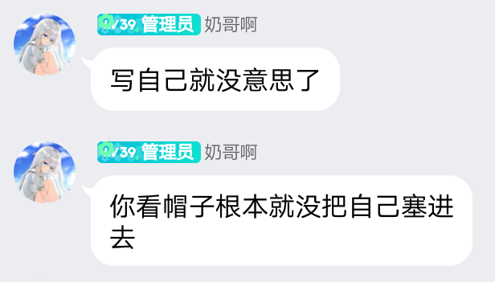

# 捉内鬼大作战

在遥远的iGene星球上，一颗小小的星球上面，这颗星球上面并没有什么特殊的，它也就是一颗普通的星球，甚至连一些高科技的产物都没有，但是它的存在却是这里最为神秘的存在，因为它拥有着一群来自于其他星系的人，他们是这个宇宙中最强大的势力之一，也是最为古老神秘的势力之一，而且他们的实力比起那些其他势力的强者还要强大，而这个宇宙中的一切都以他们为主宰，他们的名字叫做：鸽子联盟!
鸽子联盟，是一个非常奇怪的组织，它并没有任何的国家、种族、宗教，他们也没有任何的势力，但是他们的势力确实最为庞大，最为恐怖，因为他们有着太阳的帮助，有着月亮的庇护，而他们的人数众多，他们的实力最强，最为神秘莫测。他们拥有着一批非常先进的武器装备，他们拥有着一座超越了宇宙的飞船，他们的战斗力最弱，但是他们拥有最恐怖的智慧，因为他们拥有最为精密的科技装备，他们的战斗力最低，但是他们最为擅长使用智脑，他们的智脑能够轻易将整个世界掌握在手中，他们的文明已经到了一种非常恐怖的程度，这是一个极端危险的组织，也是整个宇宙最为强悍的一个组织。
这里，便是鸽子联盟的总部，在这里有着一个巨大的堡垒，这个堡垒有着超过十几万米高，它的直径大概有三百公里左右，而在堡垒的外围，则是一圈又一圈的防空警报器，这些警报器全部都是用电子元件制成的，而且是最为先进的那种，能够发射最为先进的光束。堡垒的顶层，有着一间房屋，这里的房屋并不是那种木质的，而是金属打造而成的，这间房屋里面，只坐着四个人。
其中一个是穿着灰色西装的年青男子，看着他身边的三个人，他的眼睛中带着一丝淡淡的冷笑和杀意：“真的没有想到啊，居然会有这么多人前往我的基地，他们的胆子真的很大，也不知道他们是哪里的人?他们难道就不怕死吗?还有另外一个内鬼?”这四个人，就是鸽子联盟的四个长老级别的人物，其中站着的奶哥说道：“鱼叔，他们来到这里肯定是冲着您的基地来的，而那个内鬼应该是一个小家伙吧，不管怎么样，我们必须要把他杀掉，要不然这里会引起大麻烦的。”
被称为鱼叔的人说道：“嗯，不错，不过，我不会亲自出马的，我们的目标是那个内鬼，杀掉他就行了，如果你们不敢的话，我来好了，反正我闲着也是闲着。”
奶哥说道：“不用了，我去就行了，我保证能够把他解决掉。"
鱼叔说道：“那行，不过，你可千万要小心点，毕竟那内鬼可不是表面上的那么简单的，我听说他是一个非常厉害的高手，如果他是一般的孩子的话，或许你还能够轻松解决掉他，但是他不同，这次的任务，可是关乎着我们鸽子联盟能否延续下去，如果我们的计划失败了，那么这里就会成为一片废墟，而你，就会成为炮灰!”
奶哥说道：“放心吧，鱼叔，我不会乱来的，我一定能够成功的把那小鬼弄死的，我一定会把他的脑袋拿回来，让你验收成品的!”
鱼叔说道：“那好吧，既然这样的话，那就你去吧，
记住，一定要小心点，不能够暴露自己，如果你被对方发现的话，那么你也就没有回来的必要了。”奶哥点点头，然后向门口走去，门口的镜子立刻拦住他，说道：“喂，小子，你要王嘛去啊?“
奶哥微笑着说道：“我出去买点东西。”
“哦，好吧，那你快点回来哦，要不然我就把你送回去。“说完之后，镜子就把他的房门锁上了，然后自顾自的玩着手机，根本没有理会奶哥，而奶哥看到镜子这个模样，他也是没有办法，只能够离开了，因为他也不能够拿镜子怎么办，他也知道镜子这样做是不希望自己暴露出自己的身份。
奶哥走后，镜子立刻打开手机，看到手机上面显示的消息，镜子的脸上立刻流露出了兴奋的表情，因为他收到了消息，那就是小白在一天后将会来到他的基地，并且和他见面，他看到了这条信息之后，.顿时忍不住狂笑起来，因为他实在是没有想到，这一天终于来临了!他的目标，终于到达了!他终王可以报仇了!
“小子，等着接招吧，你这次是死定了，哈哈....."镜子狂笑着说道，随即他立刻打开了电脑，登陆了一个gq，找到了一个名为”小黑”的账号，然后他输入了一个网址，紧接着，他打出了一串代码，然后输入了“密码”两个字母，紧接着，电脑屏幕上立刻弹出了一排的窗口，然后，他选择了”enter"键。
当电脑上出现一个红色的按钮之后，电脑便缓慢运作起来，一瞬间，无数的图片弹出来，每一张图片上面，都标注着一个文字，这个文字，全部都是英文字母，看起来非常的复杂和繁琐，而这个时候，镜子也是把手指放到鼠标上面，他的手指不停的敲击着键盘，很快，一连串的字符便出现了。
随后，电脑上面出现了很多的红色数据，这些红色的数据都是各种的代码，而在这些代码之中，最醒目的便是一个名叫”x”的文字，这个x就是一个代号，是一个神秘的代号，而他所写出来的代码，便是这些代码的真正的核心，这个代码就是，”X”的代号!x代表着的是什么，他们自然都非常的清楚!x就是躲猫猫大作战真正核心的东西!
当x出现在电脑上的时候，电脑上面突然出现了一个红色的按钮，紧接着，这个按钮便开始闪烁起来，随着闪烁越来越频繁，x的颜色也变成了红色。
这个时候，镜子也是停止了敲击键盘，然后他看着屏幕上面的x，嘴角勾勒出一抹邪恶的笑容，然后他的手指轻轻的点动了一下按钮，那原本在闪烁的红色光芒立刻变得暗淡了下来。"x的代号，终于出现了，不知道这次你能够给我带来怎样的惊喜呢?"镜子喃喃自语着，然后他的手指继续飞舞着，而x的代码也是开始变化了。
一秒钟，两秒钟...土秒钟，二十分钟，五士分钟，半个小时，一个小时，一个小时之后，屏幕上面的x代码终于停止了转换，而x的代码变成了绿色，绿色代表着，x已经成功破译了他所设置下来的程序。
“嘿嘿，小子，这次我看你还怎么藏起来!”镜子看着自己所设置下来的程序，脸上也是出现了一抹得意的笑容，因为他所设置下来的程序，是他的绝技!也是他这一生的骄傲，没有任何人可以解开!他的目标，就是杀掉所有的人!
当时针指向12点的时候，镜子从椅子上面站起来，向门外走去。而这个时候，在某个地方，一辆轿车正在缓缓的向前驶去，车厢里面，一个人静静的坐在副驾驶位置上面，而在驾驶室的右侧，坐着一个人，她的脸上戴着墨镜，看不到他此刻的表情，但是从她的眼睛中，却可以感受到她此刻的愤怒，这是她愤怒到了极致的表现!
这个男人不是别人，正是奶哥!他在这里等待着，等待着那个内鬼的出现!他已经迫不及待的想要亲手杀死那个内鬼了。
时间慢慢的过去了，二分一秒的流逝着，奶哥的耐性也已经到达了极限，而就在这个时候，镜子的身影也是出现在了奶哥的视线中。
镜子一边向前走，一边说道：“呵呵，终于来了吗?你这个内鬼!”
镜子来到了汽车旁边，他打开了汽车的后门，然后钻进了汽车里面。
当镜子进入到汽车之后，车门立刻关闭，镜子看着奶哥说道：“你终于来了。”
奶哥冷哼一声，说道：“废话少说，我问你，你为什么要对付小白，你难道不知道小白是我的兄弟吗?”镜子听到奶哥的话后，也是冷哼一声，说道：“是啊，你的兄弟又怎么样?你们这群狗东西就是我们的敌人!“说着，他伸手摸到了一块玻璃碎片，然后用力的捏碎，玻璃碎屑溅射而出，而镜子也是毫发未损。
奶哥的眉头皱起来，说道：“你竟敢毁坏我的汽车!”镜子听到奶哥的话，也是冷笑着说道：“是啊，我就是毁坏了你的车子又怎么样?你难道敢对我怎么样吗?你要是敢的话，我现在就杀了你!我可是说到做到!“说完，镜子便拿出了自己随身携带的匕首，匕首被他牢牢地握在了自己的手中。
看到镜子的举动，奶哥的眉头皱的更深了，镜子竟然威胁他!他的双拳也是握紧，眼睛里面充满了怒火!
“怎么样?要跟我玩吗?"镜子笑眯眯的看着奶哥说道。
“好!既然如此，那么我今天就陪你玩玩!“奶哥说完，直接掏出了手机，拨通了一个号码，电话刚刚接通，他便冷冷的开口说道：“喂，你好，是xx派出所吗?Xx公安局的吗?我是XX×公安局的奶哥，有件案子需要调查，请尽快来xx公安局一趟....."
挂断电话，奶哥对着镜子说道：“你现在可以走了。”
“你确定?我可不相信你。“镜子冷哼一声，说道。“我已经说过了，我会让你离开的!“奶哥说道。“哼!那我们就拭目以待吧!“镜子冷哼一声，随后他转身走出了汽车，向远处走去。
镜子刚刚走出车门，他便看到了一台黑色的轿车停在了他的身边，随即，车窗摇下，一个年纪大约四十岁左右的男人出现在他的视线当中，男人穿着一身警服，看上去土分的帅气，而镜子也是认识他的，正是xx派出所所长。
“孙所长，这是怎么一回事儿?“镜子看着孙所长，开口询问道。
”小李，你来说吧!“孙所长开口说道，同时他还将手上的烟放在嘴里抽了一口。
“小李?“镜子看了孙所长一眼，脸上露出一抹疑惑的神情，他根本就不知道这是哪里冒出来的家伙!
“是啊，你应该认识小李的，这是xx公安局所长。“孙所长看着镜子，开口说道。
“哦~原来是xx公安局所长，失敬，失敬了。“镜子连忙说道。
“没关系，我们走吧。“说完，孙所长便坐进了车内，然后开着车子向郊区驶去。
“所长，这是怎么回事儿?“小李看着镜子，开口说道。
“没什么，只是一些小矛盾而已。“孙所长笑着说道，同时还把手中的烟扔进了车窗里面，他可不希望自己的手下知道他和镜子之间的关系，否则的话，恐怕会引发很多不必要的麻烦。.小李点了点头，然后坐在副驾驶座的位置上，一言不发。
很快，孙所长就将镜子送到了郊外，而在郊外，有几名警察已经等候在了那里。
看到警察，镜子先是一愣，然后他才反映过来，他的眉头紧皱起来，然后说道：“我没有违法啊!我为什么要抓我啊?"
“哼哼!犯罪嫌疑人，你现在已经被包围了，我劝你東手就擒吧!“孙所长冷哼一声说道。
“呵呵，我倒想看看，你们是怎么包围我的?"镜子冷笑一声，开口说道。
“给我拿下!“孙所长直接命令道，同时也向前迈出一步，然后他直接拿出了自己的枪，瞄准镜子。.孙所长的动作士分的快速，在他拿出枪的瞬间，镜子就反映过来，然后他也是将手中的匕首插进了地面之中，借助着匕首的力量，他的身体向后滑行了五米，躲过了孙所长的子弹，并且躲过了其他几名警察的袭击!
“真是好身手啊!“孙所长开口说道。
“废话，当然好身手了，你以为我是吃素的啊!"镜
子开口说道，说完，镜子就再次挥舞着自己手中的匕首，向几名警察冲了过去!
看到镜子的动作，孙所长的脸上露出了一抹笑容，然后他直接扣动扳机，对着镜子就开了一枪!
“砰!砰!砰!”
几声枪响传来，子弹打在了镜子的身上，但是却并没有对他造成什么实质性的伤害。
“哈哈哈~这样的程度可伤害不了我!“镜子冷哼一声，继续冲向了警察。
“"哒哒哒哒.....”
孙所长连开数枪，子弹打在了镜子的身上，但是镜子的速度也是越来越快，他的攻势变得更加猛烈，几乎是瞬间就将那几个警察给解决掉了。
看到自己的同伴被镜子干掉，其他警察也都是惊讶无比，镜子的速度实在是太快了，快到让他们都不敢相信自己的眼睛。
镜子来到孙所长的面前，冷笑着说道：“老子说了，我不会受你们的制裁!你们最好乖乖的让路!否则的话，你们会付出代价的!”
“你以为你能够杀死我们吗?别忘记了我们手上有枪!“孙所长开口说道。
“哼!“镜子冷哼一声，说道：“你觉得你能够杀死我吗?”不试试看你怎么知道呢?“孙所长淡淡的说道。
镜子听到孙所长的话语之后，冷哼一声，直接从身上拿出了匕首，对着孙所长刺了过去。
看到镜子竟然敢对自己动手，孙所长也是冷笑一声，他直接用手挡住了镜子的比首，然后说道：“你是一个疯子!竟然敢对我动手!难道你不怕我们手中的子弹吗?”
“怕?老子还真不知道我会怕什么?“镜子开口说
道，同时他的手臂微微一抖，他手中的上首立刻变换方向，对准了孙所长的脑袋，然后毫不犹豫的刺了过去!
见状，孙所长也是迅速抬腿踢出，将镜子手中的匕首给踢飞出去。
孙所长虽然踢开了镜子手中的匕首，但是他的胳膊上却也留下了一条血痕，鲜血顺着伤口流淌出来，染红了他的衣衫。
镜子看到孙所长流血了，他顿时大笑了起来：“孙所长，你的实力还差得远呐，你不是我的对手!”
孙所长的脸色铁青，他没有想到镜子的实力竟然如此强悍，自己刚才踢飞他匕首的时候，虽然只是用了五成的力气，但是依旧能够感受到手臂上传来的疼痛感，而且他也感觉到自己的手臂仿佛不属于自己一般。
“小子!你的确很厉害!但是你今天注定了要败在我的手中!“孙所长开口说道，他直接举起自己手中的枪对准镜子，准备开枪射杀镜子。
镜子看到孙所长举起枪之后，他立刻后退，他也想要躲避孙所长的子弹。
孙所长的速度也非常的快，就在镜子后退的瞬间，他直接向着镜子追赶了过去，不过很显然，他慢了一拍。
就在他向镜子追赶的瞬间，镜子已经跳入到了河中。.
“噗通!”
随着一声水花翻滚的声音传来，镜子成功逃脱了!看到这一幕，孙所长的脸色一变，然后连忙转身跑向了车旁，拉开车门坐进去之后，他直接踩着油门，向着医院狂奔而去。
“妈蛋!这家伙简直就是鬼啊!“孙所长一边开车一边咒骂道。
“哼!小子，今天算是栽在你的手中了，我记住你了，你给我等着!
当奶哥得知镜子成功逃脱的消息时，整个人都傻眼了，他怎么都没有想到镜子竟然可以逃脱，而且看情况，镜子似乎还没有受伤，这是什么情况?
难道他不怕子弹吗?不怕子弹打穿自己的身体吗?镜子，到底是一个什么样的怪物啊!?
"该死的，他竟然能够成功的逃脱，实在是太诡异了!这样一个人，如果放任其生活下去的话，恐怕日后的影响肯定不小!“奶哥在心里暗暗想到。
“不行!必须要把这件事情告诉主席，让主席做出决断，这件事情不能拖延了!!
旁边的町町无法忍受奶哥大叫，说到：“奶哥，你不要总是在夜里叫来叫去!
隔壁的阿姨以为有人在家虐待你!
听到町町的话，奶哥的额头上冒出三根黑线，然后他开口问道：町町，你知不知道他是谁啊?”
“他是谁关我什么事儿啊!“町町撇嘴说道。"你知不知道他叫镜子?“奶哥再次开口问道。
“不就是一个名字吗?又不是什么大人物，我为什么要认识他呢?“町町开口说道。
“这个镜子的身份不简单，不仅如此，而且他还是一
个超级高手，我火力全开都抓不到他!你明白吗?“奶哥开口说道。
“哦?“听到奶哥的话，町町也来兴趣了，他来到床边，一双大眼睛盯着奶哥说道，“你倒是说说看，你是怎么抓不到他的，如果说不出个所以然来的话，那你以后就别跟着我混了!”
“这.....奶哥听到这句话，不由得愣住了。.
虽然他很想说自己能够抓到镜子是因为自己是神仙，但是这些话却说不出口，毕竟，他不知道镜子究竞是什么身份，如果让他说出来的话，他肯定会被町町鄙视的。
“哎呀奶哥 请不要搞得我们措手不及我们也希望能够出去 HAPPY HAPPY 奶哥时间全被你占据你却豪不领情还加倍折磨我们看你你独自高兴
奶哥是上天派来整治我们的克星
"喂喂喂，你说的都是些什么鬼啊!你是不是有毛病
啊!"
就在这个时候，孙所长的电话忽然响了起来，看到手机屏幕上的号码，他的脸上浮现出灿烂的笑容，"老板，您找我?"
“恩!我已经知道镜子的身份了，你现在立刻带着人马来我这里，将镜子给我抓捕回去!“电话里传来了孙所长的声音。
听到孙所长的话，奶哥和町町两个人也是瞪大了自己的眼睛，显然，对于孙所长的话，他们是感到非常震惊的。
“奶哥，这是真的?你真的知道镜子的身份了吗?“町町满脸期盼的看着奶哥问道。
“当然是真的了，不信的话，你们可以亲自去问问!“孙所长点头说道。
“好!好!好!我们这就去办!”
“对了，镜子这家伙不仅仅会隐身术，还会飞行术，.这是一种非常罕见的能力，你们务必小心谨慎，毛万不要让他逃跑了!“孙所长叮嘱着自己的司机翼风说道。
“恩!我知道了!”
与此同时，镜子已经来到了一个废弃工厂的附近。“这里是什么地方啊?”
“这里就是废旧的工厂!我刚才是从这里跳下去的!“镜子开口说道。
"哦!原来你是从这里逃走的，我还以为你是凭空消
失的!”
“你这家伙，你不会说话就闭上嘴巴好不好啊!”
“我说错了吗?”
“算了吧，我懒得跟你争论!"镜子摆了摆手说
道，“我先走了，你自己多保重!"说完，镜子便直接离开了。
而孙所长的司机翼风则是在废旧工厂四周搜索起来。
"喂，孙所长，您找我吗?。
孙所长接到翼风的电话之后，他开口问道：'恩!我是孙所长，你在哪里啊?你在什么地方?”
“我在工厂四周等你呢!‘翼风开口说道。
“恩!好!你就在那里等我吧!我现在马上过去!"
“恩!”
说完，翼风便挂断了电话，开始耐心的等待孙所长过来。
另外一边。
“我们快离开这里!”
说完，孙所长立刻开动汽车，朝着工厂内部驶去，他一路上开车狂弃，终于是来到了工厂的大楼前。来到工厂的大楼之后，孙所长立刻拿出钥匙开门。咔哒!!
伴随着一声清脆的声音响起，房门应声而开。
“老板，您来啦!"
看到站在屋子里面的人，翼风连忙开口喊道，他的脸上满是恭敬的表情。
“你在这里守株待免已经很久了吧?"
“老板，这件事情您知道就好了，壬万不要对外人讲，否则的话，我肯定吃不了兜着走的!“翼风开口说道。
“好的!我知道!我现在已经找到镜子那家伙了，我会把他交给你的，但是，你要答应我一件事情!"听到孙所长的话，翼风开口说道：“只要是老板吩咐的事情，我都一定会办妥的!
“嗯，那你先进去把镜子抓捕回去，然后再出来汇报情况吧!”
“好的!我现在就进去将镜子抓捕归案!“翼风开口说道。
说完，翼风转过身，朝着屋子里面走去。
来到客厅，翼风看到了坐在沙发上正在抽烟的镜子。
"镜子?”
"哦，是你啊!“镜子听到翼风的喊声，他转过头
来，看向镜子说道。
“是啊，没有想到会在这个地方遇到你!“翼风开口说道。
“我还要谢谢你呢!如果不是你的帮助的话，我现在还不一定在哪里逍遥呢!“镜子开口说道。
“我们是朋友嘛，互相帮助是应该的!"
“好了，我也就不多说其他的了，反正你已经知道我的身份了，那你也就知道怎样处理了吧!“镜子看着翼风问道。
闻言，翼风微笑着点了点头，说道：“放心吧，我一
定会处理的很好的!"
"恩!"
听到翼风的保证，镜子也没有继续多说什么，而是继续抽起自己的香烟了。
见状，翼风开口问道：“我能抽根烟吗?”“当然可以!
“谢谢!!
“不用，这根烟算是我送你的见面礼吧!“说着，镜子直接递给翼风一盒烟。
“那我就不客气了!”
说完，翼风便拆开包装袋，抽了一根烟叼在自己的嘴唇上面，然后点燃吸了起来，看样子，他似乎很喜欢抽烟。
看到翼风的模样，镜子的嘴角微微上扬，露出一丝笑容，随即开口说道：“我们走吧!”
“嗯!走吧!!
(u
孙所长和翼风来到废旧工厂的时候，镜子早就已经逃跑了。或者说，镜子是在翼风协助之下走着离开工厂的，因此，孙所长并没有看到镜子的踪影。孙所长和翼风来到废弃工厂的四周之后，开始寻找镜子的下落。
“老板，我们现在该怎么办?!
“既然我们找不到那个混蛋，我们就只能等到晚上去酒店里面了，毕竟，现在是夜里，我们想要抓住他，也不是那么容易的，而且，这么晚了，他肯定也已经睡觉了!
“好的!老板，那么我就按照你的总思去做!“翼风开口说道。
说完，翼风和孙所长两人便准备离开了废弃工厂，不过，就在两人准备走的时候，突然听到一阵急促的脚步声传了过来。
听到这阵脚步声之后，孙所长和翼风的脸色瞬间变了变。
“是谁?‘翼风开口问道。
“我们在这里!”一个声音开口说道，紧接着，三个穿着黑色衣服，带着黑色面具的男子缓慢的走了过来。
“你们是什么人?你们是谁派来杀我的吗?“孙所长立刻警惕的看着对面的几个人开口说道。
“孙所长，我们可不是什么人派来的，我们是奉命行事的!”
“奉命?奉谁的命?谁让你们这么做的?”
“孙所长，你就不用管是谁让我们这么做的，总之你只需要记住一句话就足够了，那就是，这次你必须死!”
“你们这些家伙简直太猖狂了，今天我一定不会放过你们的!”孙所长开口说道。
“孙所长，我劝你还是别费劲儿了，现在的你根本就不是我的对手，更何况，我们还有帮手在这里，所以说，你就乖乖受死吧!“为首的一名男子开口说道。
“呵呵!“听到对方的话，孙所长冷笑一声，开口说道：“你们这群混蛋，今天我一定会杀了你们的，一定会!”
“是吗?那我倒是非常期待!‘为首的男子冷笑着说道。
“翼风，我们现在怎么办?“孙所长看着翼风开口说道。
“老板!“听到孙所长的话，翼风开口说道：“现在我们已经被他们给围住了，我们想要逃跑，恐怕是不可能了，现在唯一能做的就是拖延时间，等到明天的时候，我们再做打算!”
"好!那我就跟你一起拼一把，我就不信我堂堂警察局长，还收拾不了你们这帮小鬼!”
听到孙所长的话，翼风开口说道：“孙所长，你先回去吧!我自己有分寸!”
“不行!我是不会丢下你不管的!"
“那随你吧!”
见状，翼风只能无奈的叹了一口气，因为孙所长的性格就是这样，认准的事情九匹马都拉不回来!
“翼风!你这个叛徒!”
“我告诉你!如果你真的敢动手的话，那我就算是死，也绝对不会让你得逞的!“孙所长看着翼风，咬牙切齿的开口说道。
听到孙所长的话，翼风苦笑一声说道：“你这又是何必呢?”
“何必?哼!!
“你这种人就是死一万遍都不值!”
“孙所长，如果你还当我是兄弟的话，你就不要再执迷不悟了，赶快走!我自己可以解决这帮人!”“翼风!“听到翼风的话，孙所长开口叫道。
“不要再说了!“翼风打断了孙所长的话，说道：”我的意思你应该明白吧?赶紧走!”
“不走!我是绝对不会扔下你一个人不管的!。
听到孙所长的话，翼风开口说道：“你不要固执了!我说了，这件事情和你没关系!你赶快回警察局去，你的职责是维护社会治安，这次的案件就是由你来主导的，你现在要做的，就是将功补过，而不是在这里和我耗时间!”
听到翼风的话，孙所长的脸色阴沉了下来，虽然他对翼风是十分的感激，但是他绝对不能丢下翼风独自逃脱啊!
“不行!!
“孙所长，你现在的任务就是回警察局主持大局，而不是在这里浪费时间，如果你真的觉得自己能够对付我们的话，那你就尽管留在这里吧!“翼风开口说道。
听到翼风的话，孙所长的神色变得有些犹豫了起来，因为他知道，翼风说的没错，如果自己真的留下来的话，翼风确实能够轻松摆平他们，毕竞这里只有五个人，如果翼风全力攻击的话，这五个人很快就会丧生在翼风的手中。
想到这里，孙所长咬了咬牙，开口说道：“翼风，那你自己小心一点儿，如果你遇到什么危险了，一定要给我打电话，知道吗?”
“恩，我知道了!”
“翼风，我先回去了，如果有人来了，你一定要给我
打电话，我来接应你!”
"好的，放心吧，我的运气向来很好，相信这次也是一样的!
"呵呵!
“好，我先走了，拜拜!
说完，孙所长转身离开了，看到孙所长的背影，翼风忍不住摇了摇头，随后，他看了看眼前的这五个黑衣人，开口说道：“好了，孙所长已经走了，你们可以不用再演了。还有镜子也可以出来了，不用再
躲了"
听到翼风的话，一旁的镜子从藏身处站了起来，开口说道：“没有想到，你居然连我这么隐秘的藏身之地都发现了!不愧是神级高手啊!”
"神级高手?“翼风冷笑一声，开口说道：“就凭借你们几个人就想杀我，未免太看不起我了!”
“哈哈哈哈!”听到翼风的话，其中一名黑衣人北鸡笑着说道：“看不起你?不不不，我从来都没有小瞧过你，因为你的强大是我们都无法理解的!”
翼风拿起果盘上的梨子，轻轻地剥皮吃了一块，随后开口说道：“既然我已经猜到你们了，那我也就没什么好担心的了，来吧，让我看看你们究竞有多少斤两!"
翼风说完，将手中的果肉塞进嘴巴里，大口大口的咀嚼了起来。
“哼!“北鸡说完后从桌子上拿出了一块麻著，然后用刀片将麻著的包装撕掉，随即将其丢进嘴里，咀哦了起来。
看到北鸡的举动，翼风开口问道：“你这是在做什么?难道你不怕我在这里下毒?
听到翼风的话，北鸡开口说道：“这菜都齐了，怎么能少了麻薯呢?!
“呵呵!“翼风笑了笑，并没有说什么，毕竞现在的麻薯已经是一块硬骨头了，翼风是绝对不会吃下去的!
看到翼风的反应，北鸡继续开口说道：“翼风，我告诉你，这麻薯虽然有毒，但是它对我们根本起不了作用，只要我们不停地吃这种东西，最后死的一定是你!
听到北鸡的话，翼风笑着开口说道："哦?是吗?那不如咱们试一试啊?”
"哼!“看到翼风不屑的语气，北鸡冷笑着说道："翼风，你太天真了!”
“天真吗?“翼风耸耸肩膀说道：“我怎么不觉得啊!”
“你这么说，我可要生气了!“北鸡怒声说道。
“随便你怎么说!“翼风毫不在乎的说道：“我只希望你记住，你们今天来找我的麻烦，我不会放在心上的!因为你们还不配!”
看到翼风一副无视自己的态度，北鸡顿时恼羞成怒，他开口说道：“翼风，你真是不知道天高地厚如果我是你的话，我早就吓得屁滚尿流了!”
"呵呵!翼风笑了笑，随后将手中的梨子直接丢了出去，梨子划破空气，带着呼啸之势落入到了北鸡的脑袋上。
"啊~!”
伴随着北鸡的一声惨叫，北鸡伸出右手捂住自己的额头，鮮血顺着指缝滴答滴答的往下滴落。
"翼风，你..!!
看着北鸡的模样，翼风开口说道：“怎么样?北鸡君，我刚才说了，只要你乖乖地听我的话，我是绝对不会动手杀你的，但是现在你依旧不听我的话，所以，你的结局已经注定了!
“你..!“北鸡气急败坏的开口说道：“我不相信我不相信，这种东西根本就不可能杀得了人的!!“你信不信由你，总之，你的结果已经注定了!!说完，翼风直接将手中的梨子仍在了地上，随后开始整理起衣服来。
“翼风，你等着吧，我不会善罢甘休的，等我找到了
老师，老师一定会教训你的!“北鸡开口说道。
与此同时，鱼叔等人也跟了上来，当看到北鸡和四个手下被翼风揍了一顿之后，鱼叔的表情非常的惊讶，他怎么也没有想到翼风居然会如此厉害，一个人就把这么多的人打倒，而且还将他们的头给打肿了!
“鱼叔，翼风这家伙很厉害，咱们不是他的对手啊!“北鸡开口说道。
鱼叔皱着眉头，看向了翼风，随后开口说道：“看来我们还是低估了这家伙的实力啊，不过，这也没有关系，反正现在他只是一个人，咱们六个人加在一起，一定可以制服他的!"
说完，鱼叔开口说道：“大家都准备好了吗?”“嗯!”
听到鱼叔的询问，北鸡、帕斯和另外三个黑衣人纷纷回答了一声。
帕斯听到和另外三个黑衣人的回答；鱼叔点点头，随后对着四个黑衣人开口说道：“好，那咱们就上!"
“是!”
伴随着几声响亮的声音传出，鱼叔带着其他的四个黑衣人朝着翼风冲了过去。
看到几人朝着自己冲了过来，翼风冷哼一声，然后开口说道：“不自量力!!
随后，翼风将手中的麻薯扔在了地上，随后直接朝着北鸡冲了过去。
看到翼风的举动，鱼叔四个人顿时露出了笑容，因为在他们看来，翼风这完全就是不自量力，不仅没有丝毫的战斗力，反而还自寻死路。
就在这千钧一发之际，奶哥也赶到了战场，只见奶哥快速地跑了上来，一边跑一边喊道：“大家小心啊!这是一种麻薯!”
听到奶哥的话，翼风和北鸡等人纷纷惯住了，他们怎么也没有想到奶哥居然也懂得麻薯!
“麻痹的，你这小兔患子，居然敢骗我!“北鸡怒声吼道。
看到北鸡的反应，奶哥立刻摇头说道：“不不不，不是的，我只是不希望你们受伤，这麻薯虽然有麻痹的效果，但是它却并没有麻醉的功效，而且也没有任何毒性，所以，我才会提醒你们的啊!”
奶哥说完，，翼风笑了笑，，开口说道：“你还真是聪明
啊!"
“废话少说!“奶哥怒声喝道，听到奶哥的话，翼风的脸色变得阴沉起来，他开口说道：“既然你自己找死，那么就别怪我辣手摧花了!”
“哈哈，真是可惜啊!”
“可惜什么?“翼风不解地问道。
“可惜我的麻袋中还剩下这么多麻薯啊!”奶哥笑嘻嘻的说道。
听到奶哥的话，翼风的眼睛瞪得老大，开口说道：“麻袋中还有这么多?!
“当然了，我的麻袋中可是装满了好多好多的麻薯啊!“奶哥开口说道。
“那我可不可以把这些麻薯抢走呢?"翼风笑眯眯的问道。
“当然可以啦!“奶哥一副无所谓的样子说道。
“既然你同意了，那么我就不客气了啊!“翼风笑着说道。
"嗯嗯嗯!!
"嗖嗖嗖!!
看到翼风冲向自己，鱼叔和四个手下立刻挡在了翼风的身前，而翼风则是从麻袋中抓出一袋麻薯，然后快速地将其丢了出去。
"轰轰轰!!
一阵巨大的爆炸声传出，那几袋麻薯瞬间炸碎，化作漫天飞舞的粉未消失在了天空中。
看到这一幕，鱼叔的嘴角抽播了两下，随后开口说
道：“翼风，你真的很厉害!!
“那是必须的!”翼风得意洋洋的说道。
“好了，不管怎么说，你的确帮助了我，不然的话，我们还真拿这家伙没有办法呢!”鱼叔笑眯眯的说道：“我代替我们所有人感谢你的!”
听到鱼叔的话，翼风摆摆手说道：“鱼叔言重了，我也只不过是做了一点自己该做的事情而已，你不用放在心上的!!
“那好，我就先走了!”
说完，鱼叔便转身离开了。
看到鱼叔的背影，翼风的眼神中闪过一抹疑惑之色。
鱼叔的背影看上去好像有一些熟悉，但是他又不知道为什么会觉得熟悉，难道是自己认错了人吗?想到这儿，翼风摇了摇头，将这个想法抛到了脑海中，毕竞这次自己只不过是为了救下镜子而已，至于其他的事情，他可是一概不知道，更加不知道眼前的这些黑衣人究竞是谁。
“喂，你叫什么名字啊?“北鸡来到翼风的身旁，开口问道。
“我叫翼风，你是哪位?“翼风开口问道。
听到翼风的询问，北鸡笑着说道：“哦，我叫北鸡，是鱼叔的手下，刚才多谢你的援手，要是没有你的话，恐怕我们已经死在麻薯的攻击之下了!”
“呵呵呵!举手之劳而已，不值一提的!"翼风笑眯眯的说道。
“不行，你刚才救了我们，这次无论如何我们都要诗你吃饭!‘北鸡继续开口说道。
“额，好吧，那就恭敬不如从命了啊!”
随后，北鸡、奶哥、翼风以及镜子五个人便一块离开了。.
就在五个人离开没多久，四辆汽车突然停靠在了崖边。
“鱼叔，你看看，刚才有什么异常吗?”“嗯，看上去好像没有什么异常啊!”
“那就奇怪了，我们的人为什么还不来接我们呢?”听到对方的话，其余四人纷纷开始打探周围的环境，想要看看周围是否有敌人埋伏。
就在四个人打探周围环境的时候，翼风一行人已经离开了。
看到周围的景象，翼风皱起了眉头。
这个地方，正是之前翼风他们进入森林的位置，而此时在翼风他们进入森林没多久，那四辆汽车就已经出现在了这里。
“看样子这里肯定有埋伏啊!”北鸡开口说道。
“不错，如果是这样的话，那么我们可能会遇到很大的危险!‘翼风开口说道。
听到翼风的话，北鸡点了点头，说道：“我也是这么认为的，，我们应该赶紧离开这里，要不然的话一旦被他们包围的话，那我们就麻烦了啊!”
“嗯，我知道了!”
听到翼风的话，众人立刻开始准备逃亡。
就在众人准备离开的时候，翼风忽然停了下来，然后指着前方的森林说道：“我们不能往森林深处跑，要是往森林深处跑的话，一旦陷入敌人的包围圈，我们将无路可逃!”
“翼风说的对!我们不能往森林深处跑!“鱼叔开口说道。
“那你们有什么办法可以躲避他们吗?“翼风开口问道。
“我们有一套迷踪步法!“北鸡开口说道。
“迷踪步法?“翼风皱起眉头思考着。
看到翼风的表情，鱼叔开口说道：“我们可以使用迷
踪步法进行隐藏!"
听到鱼叔的话，翼风开口问道：“迷踪步法有什么特殊的吗?”
听到翼风的询问，北鸡开口说道：“迷踪步法是我们躲猫猫的一种非常高级的轻功，我们通常称之为：锁跳!”
听到北鸡的话，翼风顿时恍然大悟。锁跳!
这是一种非常高级的轻功，能够借助树木或者草丛的力量进行跳跃，在跳跃的过程中能够发挥出很强的力量。
在古代，有些武林高手可以凭借自己的内力和外力进行跳跃，但是现在却没有办法依靠这样的方式来逃脱。
“锁跳!”
“锁跳!"
听到北鸡的话，翼风开口说道：“那好，我们就按照你说的办法来进行，只要不让他们找到我们的行踪就行!”
"嗯，那我们现在就开始修炼锁跳!"
随后，五个人立刻开始练习起了锁跳。
한
半个小时以后，五个人终于結束了锁跳。
"呼~"
"累死我了，这锁跳实在是太耗费体力了!“北鸡喘着粗气说道。
“没办法，这锁跳需要消耗体力和精神力，所以才会消耗比较长的时间!“奶哥开口解释道。
"嗯，那我们现在可以动身了吗?“翼风开口问道。听到翼风的询问，北鸡点了点头，说道：“当然可以，我们走吧!
"好!”
话音落下，五个人便朝着森林深处冲了进去。
与此同时，距离他们不远的地方。
几个人的身形突兀的出现在了这里。
"镜子，我们的人已经全部出现在这里了!‘其中一个男人开口说道。
听到男人的话，镜子开口说道：“那我们就可以进行下一步计划了!”
“好的，那我们这就出发!”
说完，几个人身影便快速的向着远方飞奔而去。
此时的翼风等人正在森林中飞舞着。
就在翼风等人飞舞的时候，忽然听到远处传来了几声枪响，听到这阵阵枪声，翼风的脸色立刻变了。.“不好，敌袭!”
听到翼风的喊声，北鸡和翼风的奶哥两个人顿时停下脚步。
“是敌人!“北鸡开口说道。
“我们快回去吧!“北鸡说完，就转身朝着身后的树林中走去。
此时翼风几个人已经来到了树林的边缘处。“北鸡，我们怎么办?“奶哥开口问道。
“我们先躲起来，等敌人离开之后再出来!北鸡开口说道。.
“嗯!”
听到北鸡的回答，奶哥、翼风还有鱼叔三个人都同意了北鸡的意见。
于是，四个人立刻躲藏在了树林中。
片刻后，几个黑衣男人走了进来，在看到四个人都躲在树林中以后，为首的一名男人冷笑了一声说道：“哼!还真是天堂有路你不走，地狱无门你闯进来!你们这四个小家伙今天谁也别想活着离开这里!”
听到为首男人的话，北鸡等人都露出了愤怒的表情，他们万万没有想到竞然会碰到这些家伙，这些人竞然想要杀掉他们!
"翼风、鱼叔，你们两个保护好北鸡，这次的事情就交给我了!“奶哥开口说道。
“没问题!“翼风开口说道。"嗯!”
说完以后，奶哥的目光瞬间盯住了为首男人，一股浓烈的战斗欲望顿时从奶哥的眼眸之中涌现了出来。
奶哥，火力全开!
“哼!”
感觉到奶哥的视线，为首男人冷哼了一声，一股恐怖的杀机立刻从他的体内涌现了出来。
与此同时，翼风也察觉到了奶哥身上散发出的杀意，当即，翼风立刻站出来说道：“你们不要乱来，我警告你们，千万不要惹到他，他可是鸽子联盟的成员，他身后有很多人!”
“呵呵，我管他有什么背景呢，只要惹到我，我就要他的命!”
话音落下，为首男人便举起右手，对着奶哥开了一枪。
"砰!"
枪声响起的一刹那，奶哥的身影也消失在了原地，而他刚才站立的位置留下了一个弹孔。
见状，奶哥的嘴角微微扬起。
看到奶哥这幅模样，翼风、北鸡和鱼叔三个人顿时愣住了。
这时候，为首男人开口说道：“我说了，你们谁敢乱来，那我就要他的命，现在你们相信我没有骗你们了吧!"
“奶哥，他们真的是鸽子联盟的成员?“鱼叔开口问道。
奶哥点了点头。
听到奶哥的话，北鸡开口说道：“既然这样的话，那
你们赶紧回去吧!不然的话，你们很危险的!""嗯，我知道了，那我们回去了!“奶哥开口说道。“等等!“就在奶哥准备离开的时候，翼风开口说道。
“翼风，你还有什么事儿?‘北鸡开口问道。
“没什么，我只是想问问鸽子联盟到底是做什么的?他们的人数有多少?“翼风开口说道。
听到翼风的话，奶哥开口说道：“鸽子联盟，是中国排名前三的躲猫猫组织，他们的人数并不是很多，最多也只有几千人而已!”
“哦!“翼风应了一声以后，开口说道：“你们赶紧离
开吧，我们的任务完成了，就会离开!”“那我们就先离开了!”
说完以后，北鸡等人就快速的向着外面跑了出去。见北鸡等人走远以后，奶哥才开口问道：“翼风，我们就这样放过这帮家伙吗?”
“不放过能够怎么办呢?“翼风开口说道：“我们又打不过，如果和他们硬拼的话，只有死路一条啊!所以，我们就只有忍下这口恶气，然后再想办法对付他们就是了!!
“可是，我们难道就这样忍下去了吗?“鱼叔开口说道。
“鱼叔，我们现在还能怎么办?”翼风叹了口气，开口说道。
奶哥和北鸡的脸上也露出了一抹沮丧之色。
“算了，反正他们也已经逃不掉了!等他们回去报仇以后再找我们算账也不迟!“奶哥叹了口气说道。奶哥的话让北鸡点了点头，开口说道：“嗯，那我们就暂且将这件事情压制下来，等待机会再收拾他们也不晚!”
听到北鸡的话，翼风、奶哥和鱼叔三个人的脸上都露出了一丝苦涩的神色。.
就这样，四个人继续往前迫击。
就这样，四个人又跑了十分钟左右的时间，前方的树木终于减少了很多，前方也终于出现了一座小镇。这个小镇名为熊头镇。
这里的街道上，到处可以看到穿着各式服装的人群。
"呼!好累啊!“奶哥开口说道。
奶哥的话音落下以后，奶哥身旁的鱼叔开口说道：“我们也去休息一下吧!!
奶哥听到鱼叔的话，点了点头。
"呼哧，呼味~”
“这次的任务总算是结束了!“翼风开口说道。
“嗯!“北鸡和鱼叔也都纷纷开口附和。

**power by 彩云小梦**
**精彩评论**

